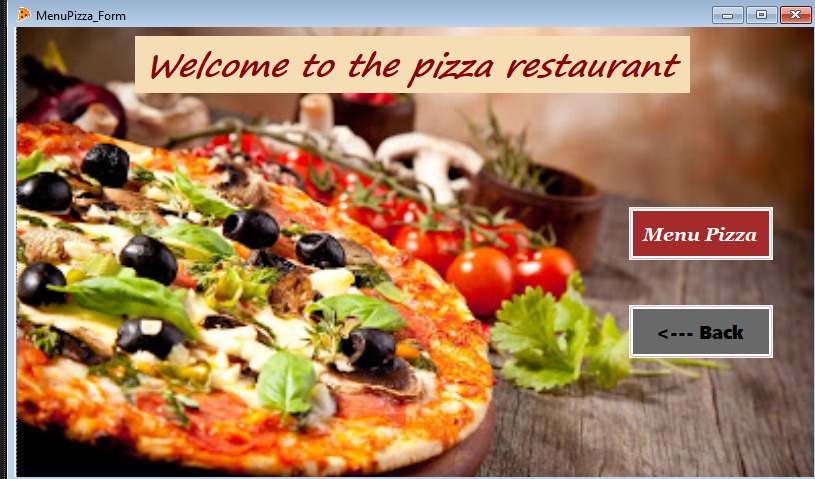
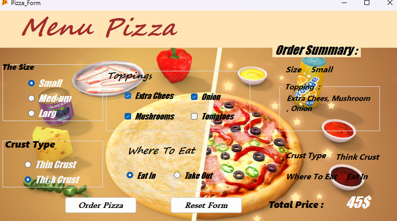

# 🍕 Pizza Ordering System (C# WinForms)

An interactive desktop application built with **C#** and **Windows Forms**. This project simulates a pizza restaurant's ordering process, focusing on dynamic UI handling and user-friendly navigation.

---

## 📝 About the Project
This application was developed as an educational project to demonstrate the use of **Windows Forms** controls (RadioButtons, CheckBoxes, Groups) and how to manage data flow between different forms. 

> **⚠️ NOTE:** This repository is currently in the **Testing & Demo phase**. It is designed to showcase the interface and ordering logic.

---

## ✨ Key Features
*   **Intuitive Welcome Screen:** A simple entry point to the restaurant menu.
*   **Real-time Customization:** 
    *   Select sizes (Small, Medium, Large).
    *   Choose crust types (Thin, Thick).
    *   Add multiple toppings (Extra Cheese, Mushrooms, Onions, Tomatoes).
*   **Live Order Summary:** Displays all your choices instantly in a summary panel.
*   **Automatic Price Calculation:** Totals up the cost based on every selection.
*   **Navigation & Control:** Fully functional "Back" and "Exit" buttons for a smooth trial.

---

## 📸 Project Preview

  
  

---

## 🧪 How to Test the Application
You don't need Visual Studio to try it! Follow these steps for a **Quick Trial**:

1.  **Download:** Download the file named Pizza-App_EXE.zip
2.  **Extract:** and extract it to your computer.
3.  **Run:** Open the folder and double-click `Pizza_Restaurant.exe`.
4.  **Explore:** Try selecting different sizes and toppings to see the price change!

---

## 🛠 Tech Stack
*   **Language:** C# (#CSharp)
*   **UI Framework:** Windows Forms (WinForms)
*   **IDE:** Visual Studio 2019
*   **Platform:** .NET Framework / .NET Core

---

## 👨‍💻 Installation for Developers
If you want to explore the source code:
1.  Download the file named WindowForm_OrderPizza.zip and extract it to your computer.
2.  Open the `.sln` file in **Visual Studio**.
3.  Restore NuGet packages (if any).
4.  Press **F5** to run and debug.

---
### 🤝 Feedback
Since this is a **Demo version**, I would love to hear your feedback! Feel free to open an *Issue* or reach out.

*Created with ❤️ by a Passionate .NET Student.*
